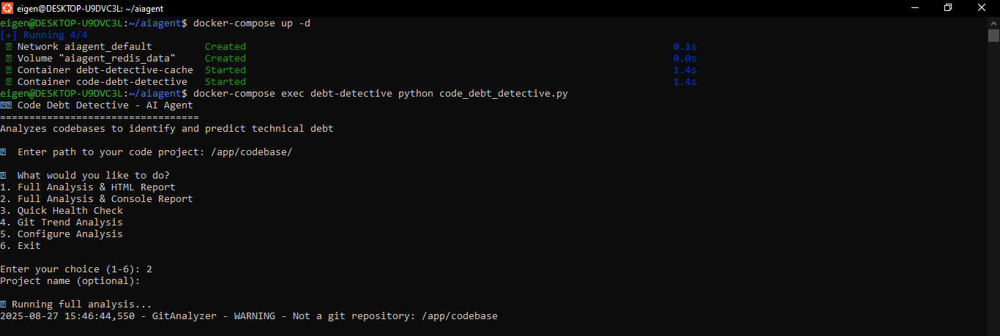
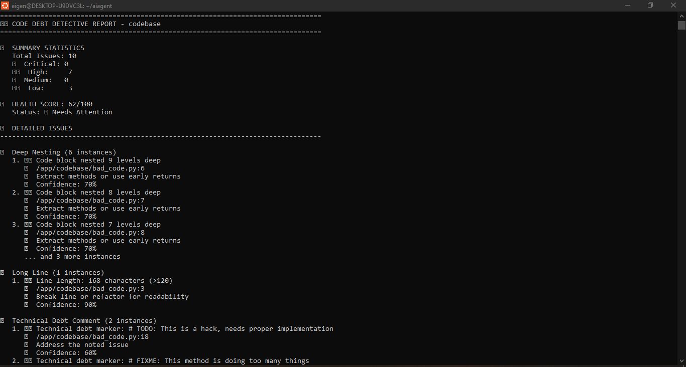
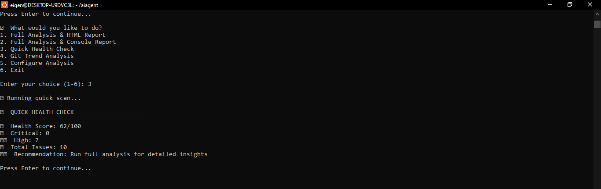
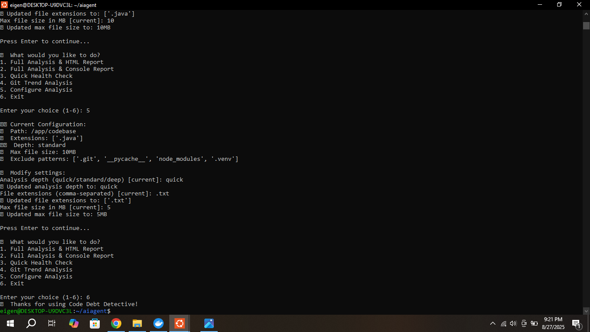

# Code Debt Detective Prototype - AI Agent

## 🚀 Overview

**Code Debt Detective Prototype** is an intelligent AI-powered tool that analyzes codebases to identify and predict technical debt. This prototype leverages advanced algorithms to provide comprehensive code quality assessments, helping developers maintain cleaner, more maintainable codebases.

## ✨ Key Features

- **🔍 Comprehensive Code Analysis**: Deep scanning of codebases with configurable depth levels
- **📊 Technical Debt Detection**: Identifies various types of technical debt including:
  - Deep nesting issues
  - Long lines and readability problems
  - Technical debt comments (TODO, FIXME markers)
  - Function complexity issues
- **📈 Health Scoring**: Provides an overall health score (0-100) for your codebase
- **📋 Multiple Report Formats**: 
  - Detailed HTML reports
  - Console output
  - JSON data export
- **⚡ Quick Health Checks**: Fast overview of codebase health
- **🛠️ Configurable Analysis**: Customizable file extensions, exclusion patterns, and analysis depth
- **🐳 Docker Support**: Easy deployment and consistent environment setup

## 🎯 Analysis Categories

### 1. Deep Nesting Detection
- Identifies code blocks with excessive nesting levels
- Suggests refactoring opportunities for better readability

### 2. Line Length Analysis
- Detects overly long lines that impact readability
- Configurable character limits with smart suggestions

### 3. Technical Debt Comments
- Scans for TODO, FIXME, and other technical debt markers
- Provides confidence ratings for identified issues

### 4. Function Complexity
- Analyzes functions with too many parameters
- Suggests using configuration objects or dataclasses

## 📸 Screenshots

### Main Menu Interface

*The intuitive main menu offering various analysis options*

### Full Analysis Report

*Comprehensive analysis showing health score and detailed issue breakdown*

### Quick Health Check

*Fast health overview with key metrics and recommendations*

### Configuration Settings

*Flexible configuration options for customized analysis*

## 🎥 Demo Video

Watch our comprehensive walkthrough of the Code Debt Detective Prototype:

*[Click here to view the full demo video on Google Drive](https://drive.google.com/your-video-link-here)*

## 🚀 Quick Start

### Prerequisites
- Python 3.8+
- Docker (optional)
- Git

### Installation

1. **Clone the repository**
   ```bash
   git clone https://github.com/Vaibhav17t/codebase_review.git
   cd codebase_review
   ```

2. **Using Docker (Recommended)**
   ```bash
   docker-compose up -d
   docker-compose exec debt-detective python code_debt_detective.py
   ```

3. **Manual Installation**
   ```bash
   pip install -r requirements.txt
   python code_debt_detective.py
   ```

## 💡 Usage

1. **Start the application**
   ```bash
   python code_debt_detective.py
   ```

2. **Choose your analysis type**:
   - **Full Analysis & HTML Report**: Comprehensive analysis with visual report
   - **Full Analysis & Console Report**: Detailed console output
   - **Quick Health Check**: Fast overview of codebase health
   - **Configure Analysis**: Customize analysis parameters

3. **Enter your project path** when prompted

4. **Review the results** in your preferred format

### Analysis Options

| Option | Description | Output |
|--------|-------------|--------|
| 1 | Full Analysis & HTML Report | Detailed HTML report with visualizations |
| 2 | Full Analysis & Console Report | Complete console output with all metrics |
| 3 | Quick Health Check | Fast health score and key statistics |
| 4 | Git Trend Analysis | Version control trend analysis |
| 5 | Configure Analysis | Customize analysis parameters |

## 📊 Sample Output

```
🔍 CODE DEBT DETECTIVE REPORT - codebase
===============================================

📊 SUMMARY STATISTICS
Total Issues: 10
🔴 Critical: 0
🟠 High: 7
🟡 Medium: 0
🟢 Low: 3

❤️ HEALTH SCORE: 62/100
Status: 🔴 Needs Attention

📋 DETAILED ISSUES
------------------
🔍 Deep Nesting (6 instances)
1. 🟠 Code block nested 9 levels deep
   📁 /app/codebase/bad_code.py:6
   💡 Extract methods or use early returns
   🎯 Confidence: 70%
```

## 🛠️ Configuration

The prototype supports extensive configuration options:

- **File Extensions**: Configure which file types to analyze
- **Analysis Depth**: Set scanning depth (quick/standard/deep)
- **Exclusion Patterns**: Ignore specific directories or files
- **File Size Limits**: Set maximum file sizes for analysis
- **Custom Rules**: Define custom technical debt patterns

## 🏗️ Architecture

```
Code Debt Detective Prototype
├── 🧠 AI Analysis Engine
├── 📊 Report Generator
├── ⚙️ Configuration Manager
├── 🐳 Docker Container
└── 📈 Health Score Calculator
```

## 🤝 Contributing

We welcome contributions to improve the Code Debt Detective Prototype! Please see our [Contributing Guidelines](CONTRIBUTING.md) for details.

1. Fork the repository
2. Create a feature branch (`git checkout -b feature/amazing-feature`)
3. Commit your changes (`git commit -m 'Add amazing feature'`)
4. Push to the branch (`git push origin feature/amazing-feature`)
5. Open a Pull Request

## 📈 Roadmap

- [ ] **AI-Powered Suggestions**: Machine learning-based refactoring recommendations
- [ ] **IDE Integration**: Plugin support for popular IDEs
- [ ] **Team Dashboard**: Multi-project monitoring and team analytics
- [ ] **CI/CD Integration**: Automated technical debt tracking in pipelines
- [ ] **Custom Rule Engine**: User-defined technical debt patterns
- [ ] **Historical Tracking**: Long-term technical debt trend analysis

## 🐛 Known Issues & Limitations

- Currently optimized for Python codebases (multi-language support coming soon)
- Large codebases (>100MB) may require extended analysis time
- Git repository detection requires proper `.git` folder structure

## 📄 License

This project is licensed under the MIT License - see the [LICENSE](LICENSE) file for details.

<div align="center">
</div>
